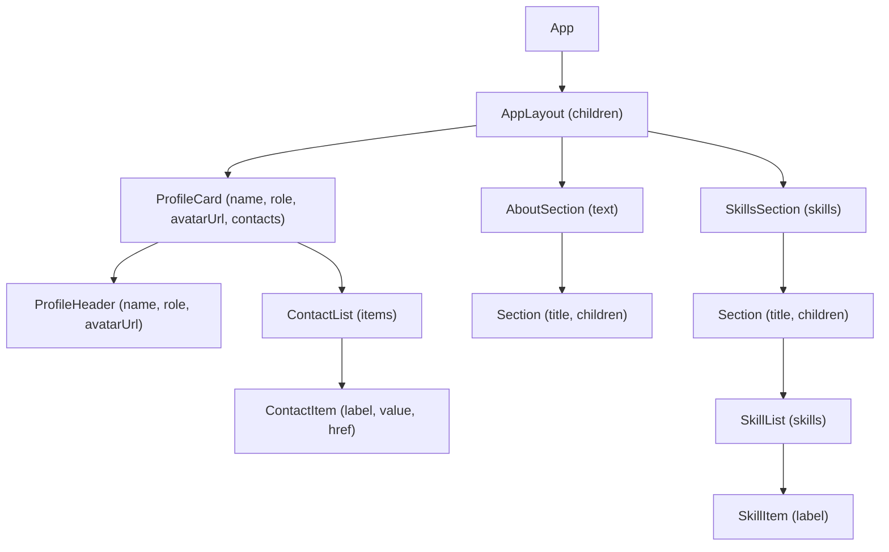

# Diagram drzewa komponentów

```mermaid
graph TD
  App["App"] --> AppLayout["AppLayout (children)"]

  AppLayout --> ProfileCard["ProfileCard (name, role, avatarUrl, contacts)"]
  ProfileCard --> ProfileHeader["ProfileHeader (name, role, avatarUrl)"]
  ProfileCard --> ContactList["ContactList (items)"]
  ContactList --> ContactItem["ContactItem (label, value, href)"]

  AppLayout --> AboutSection["AboutSection (text)"]
  AboutSection --> SectionAbout["Section (title, children)"]

  AppLayout --> SkillsSection["SkillsSection (skills)"]
  SkillsSection --> SectionSkills["Section (title, children)"]
  SectionSkills --> SkillList["SkillList (skills)"]
  SkillList --> SkillItem["SkillItem (label)"]
```
