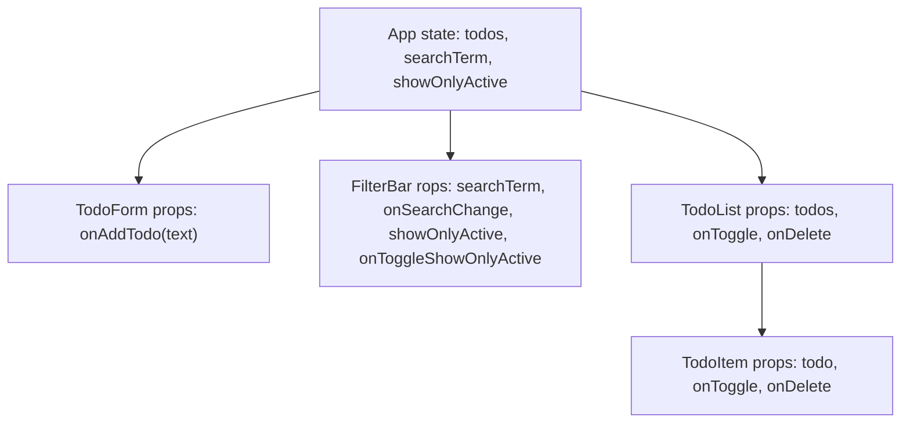

# Todo List – Component Tree

```mermaid
graph TD
	App["App state: todos, searchTerm, showOnlyActive"]
	TodoForm["TodoForm props: onAddTodo(text)"]
	FilterBar["FilterBar rops: searchTerm, onSearchChange, showOnlyActive, onToggleShowOnlyActive"]
	TodoList["TodoList props: todos, onToggle, onDelete"]
	TodoItem["TodoItem props: todo, onToggle, onDelete"]

	App --> TodoForm
	App --> FilterBar
	App --> TodoList
	TodoList --> TodoItem
```
