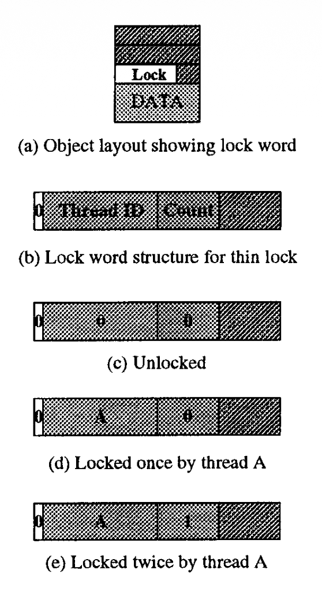
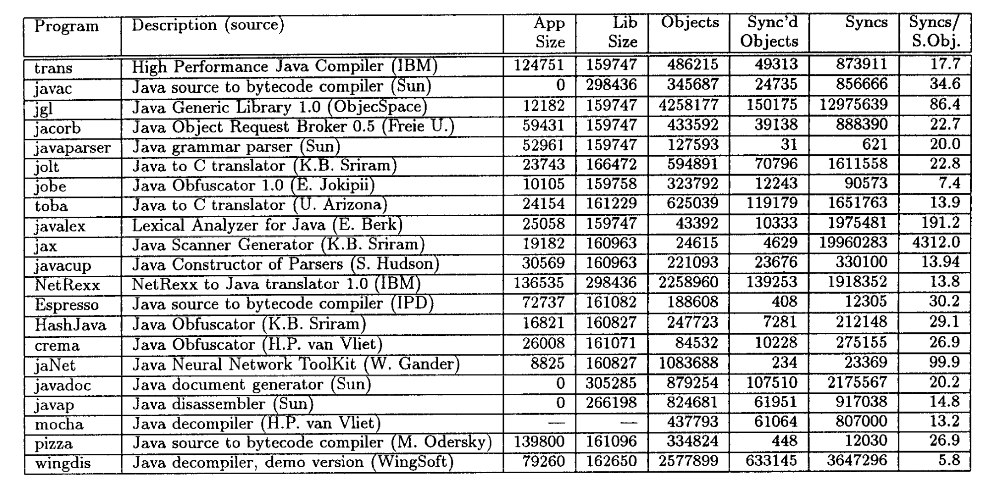
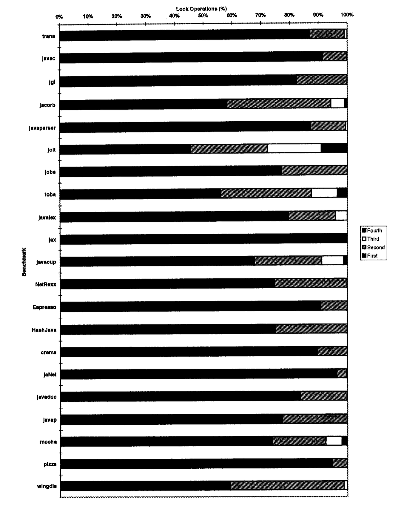
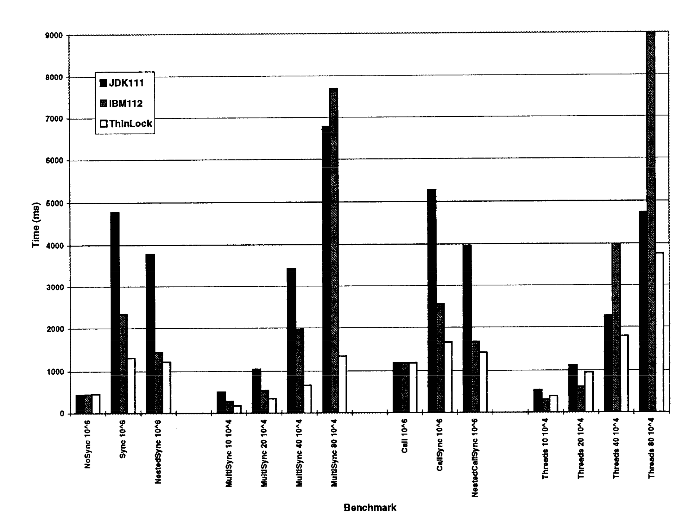
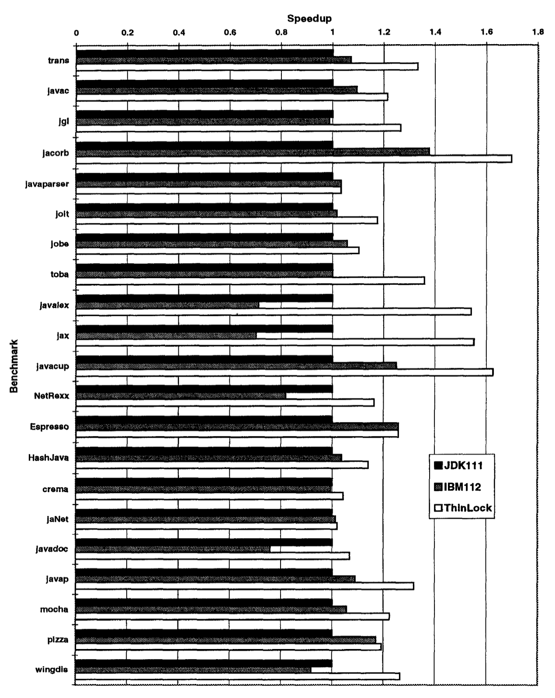

# Lekka implementacja zamków dla języka Java – "Thin Locks"

## Wstęp

### `synchronized` a lock

W Javie każde użycie `synchronized` wymusza semantykę monitora (wzajemne wykluczanie). JVM mapuje to na konkretne struktury blokad (locki). Klasyczne implementacje (JDK 1.1) używają ciężkich monitorów alokowanych poza obiektem, co jest kosztowne nawet bez rywalizacji.

### Monitory

Metody `synchronized` oraz są powszechne w bibliotekach (np. `Vector`). Nawet programy jednowątkowe płacą narzut za obsługę monitorów, co potrafi spowolnić wykonanie nawet dwukrotnie.

### Problem z zagnieżdżaniem locków

Java obsługuje reentrantność (wątek może wielokrotnie zablokować ten sam obiekt). Tradycyjne podejście wymaga śledzenia licznika zagnieżdżenia w ciężkiej strukturze monitora. Thin locks optymalizują to, kodując płytkie zagnieżdżenie bezpośrednio w nagłówku obiektu.

### Zalety thin-locków

* **Szybkość:** Kilkanaście instrukcji maszynowych dla lock/unlock bez rywalizacji.
* **Kompaktowość:** Wykorzystują tylko 24 bity w nagłówku, nie powiększają obiektu.
* **Skalowalność:** Minimalizują operacje atomowe na magistrali pamięci.
* **Wydajność:** Do 5x szybciej w mikrobenczmarkach, do 1.7x w realnych aplikacjach.

## Opis algorytmu

### Częstość występowania sytuacji

Pomiary wykazały hierarchię częstości:

1. Blokowanie wolnego obiektu (najczęstsze – mediana 80%).
2. Płytkie zagnieżdżenie (ten sam wątek).
3. Głębokie zagnieżdżenie.
4. Rywalizacja (inny wątek).

### Fat-locks (istniejące rozwiązanie)

To pełne, ciężkie monitory obsługujące kolejki wątków i `wait/notify`. Thin locks są tylko nakładką optymalizacyjną. W trudnych przypadkach (rywalizacja) następuje "inflacja" do fat-locka.

### Compare-and-Swap (CAS)

Algorytm opiera się na atomowej instrukcji procesora (CAS). Pozwala ona bezpiecznie przejąć wolny lock jednym rozkazem, bez użycia ciężkich mechanizmów systemowych.[^1]

### Headery obiektów

W implementacji IBM JDK każdy obiekt ma 3-słowowy nagłówek. Autorzy wygospodarowali w nim 24 wolne bity, nie zwiększając rozmiaru obiektu.

### Struktura 24 bitów locka



Układ bitów w nagłówku:

* **Bit 1 (Monitor Shape):** `0` = thin-lock, `1` = fat-lock (referencja).
* **Bity 2-16 (Thread ID):** `0` = odblokowany, `>0` = ID wątku właściciela.
* **Bity 17-24 (Count):** Licznik zagnieżdżenia minus 1 (zakres 0-255).

Jeśli bit shape to `1`, pozostałe bity są indeksem do zewnętrznego fat-locka.

### Kiedy thin vs fat

* **Thin-lock:** Brak rywalizacji, brak `wait/notify`, płytkie zagnieżdżenie (<257).
* **Fat-lock:** Rywalizacja, użycie `wait/notify` lub przepełnienie licznika zagnieżdżenia.
Raz "napompowany" lock (inflacja) pozostaje fat-lockiem do końca życia obiektu.

### Implementacja

* **Lock bez rywalizacji:** CAS na nagłówku. Jeśli sukces (zamiana 0 na ID wątku) -> mamy lock.
* **Unlock bez rywalizacji:** Zwykły zapis (store) zerujący ID wątku. CAS niepotrzebny, bo tylko właściciel może zdjąć locka.
* **Zagnieżdżenie:** CAS nieudany -> sprawdzenie czy ID w nagłówku == ID wątku. Jeśli tak, inkrementacja licznika (zwykły store).
* **Rywalizacja:** CAS nieudany i ID właściciela jest inne -> spin-lock (czekanie w pętli), a następnie wymuszenie inflacji do fat-locka.

```java
public static void lock(Object obj) {
    int expected = header & ~0xFFFFFF;  // czytaj header word
    int newValue = expected | (ThreadID << 8);
    
    if (cas(obj, expected, newValue)) return;  // Lock bez rywalizacji
    
    // Nested lock?
    if ((header >>> 23) == 0 && ((header ^ (ThreadID << 8)) >>> 8) < 255) {
        header = header + 256;  // inc count (zwykły store)
        return;
    }
    
    // Rywalizacja - spin-wait
    while ((header = header >>> 23) == 0 && (header & 0x7FFF00) != (ThreadID << 8)) {}
    
    // Inflacja do fat-lock
    FatLock fatLock = new FatLock();
    int monitorIndex = FatLockTable.assign(fatLock);
    header = (~0xFFFFFF) | monitorIndex;  // shape=1 + index
}

public static void unlock(Object obj) {
    if ((header >>> 23) == 1) {  // fat-lock
        FatLock fatLock = FatLockTable.get(header);
        fatLock.unlock();
        return;
    }
    
    // Thin-lock
    int expected = (header & ~0xFFFFFF) | (ThreadID << 8);
    if (header == expected) {  // count=0
        header = header & ~0xFFFFFF;  // Unlock
    } else if ((header ^ (ThreadID << 8)) > 0) {  // Nested
        header = header - 256;  // dec count
    }
}
```

### Spinowanie a lokalność

Spinowanie (aktywne czekanie) jest kosztowne, ale stosowane tylko raz – przy pierwszej kolizji. Dzięki zasadzie "lokalności rywalizacji" (jak raz była kolizja, pewnie będzie znowu), obiekt od razu staje się fat-lockiem i kolejne kolizje obsługuje systemowa kolejka.

## Pomiary wydajności

### Porównanie

* **ThinLock:** Opisywana implementacja.
* **JDK111:** Standardowy port Sun JDK (wolny, cache monitorów).
* **IBM112:** Wersja z optymalizacją "hot locks" (prealokowane monitory).

### Macro-benchmarki



Testy na całych programach (`javac`, `javadoc`, parsery). Większość jednowątkowa – pokazuje zysk z usunięcia narzutu synchronizacji w bibliotekach.

### Dlaczego testy jednowątkowe?

Celem thin-locków jest zdjęcie kosztu za używanie thread-safe bibliotek w kodzie sekwencyjnym. Różnice widać tu najwyraźniej.

### Statystyki operacji



Mediana 80% operacji to blokowanie wolnego obiektu. Zagnieżdżenie nigdy nie przekroczyło poziomu 4 (duży zapas dla 8-bitowego licznika).

### Micro-benchmarki

Syntetyczne pętle testujące konkretne przypadki: `Sync` (pierwszy lock), `NestedSync` (zagnieżdżenie), `Threads` (wielowątkowa rywalizacja).

### Wyniki micro



* Inicjalny lock (`Sync`): **3.7x** szybciej niż JDK111.
* Skalowalność: Thin-lock jako jedyny skaluje się liniowo przy dużej liczbie obiektów (brak thrashingu cache'a monitorów).

### Przyspieszenie ogólne



Średnie przyspieszenie programów: **1.22x**, maksymalne **1.7x**.

## Podsumowanie i odniesienia

1. **Podobieństwo do MCS:** Jak MCS locki, wymagają tylko jednej operacji atomowej przy blokowaniu, ale są lepsze przy odblokowaniu (zwykły store).
2. **Implementacja:** Zrealizowane w Sun JDK (zachowano kompatybilność).
3. **Syntetyki:** Do 5-krotnego przyspieszenia w mikrobenczmarkach.
4. **Realne aplikacje:** Zysk rzędu 20-70% w rzeczywistych programach.
5. **Pamięć:** Brak narzutu pamięciowego (wykorzystanie nagłówka).
6. **Oszczędność:** Fat-locki tworzone są leniwie (tylko przy rywalizacji), co drastycznie oszczędza pamięć przy tysiącach obiektów, które nigdy nie doświadczają kolizji.
