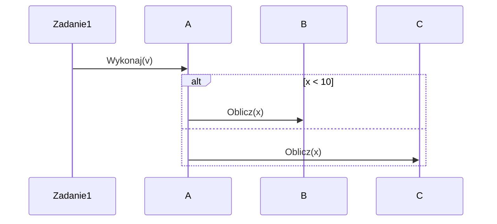

```mermaid
sequenceDiagram
    participant Zadanie1
    participant A
    participant B
    participant C

    Zadanie1->>A: Wykonaj(v)
    alt x < 10
        A->>B: Oblicz(x)
    else
        A->>C: Oblicz(x)
    end
```