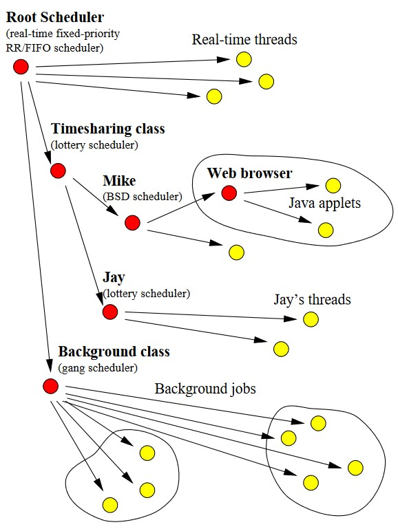

# CPU Inheritance Scheduling

## Wstęp (5 minut)

- Powitanie i przedstawienie tematu
- Krótkie omówienie znaczenia zarządzania czasem procesora w systemach operacyjnych
- Cel referatu

## Tradycyjne mechanizmy szeregowania (7 minut)

- Opis tradycyjnych metod szeregowania procesów
- Wady i ograniczenia tradycyjnych metod
  - Sztywność polityk szeregowania
  - Problemy z dostosowaniem do indywidualnych potrzeb aplikacji
  - Problemy z inwersją priorytetów

## CPU Inheritance Scheduling - Wprowadzenie

### Definicja CPU Inheritance Scheduling

**CPU Inheritance Scheduling** to innowacyjne podejście do zarządzania czasem procesora, które pozwala na większą elastyczność w szeregowaniu wątków i procesów w systemach operacyjnych. W przeciwieństwie do tradycyjnych metod szeregowania, gdzie polityki są sztywne i ograniczone do z góry ustalonych klas priorytetów, CPU Inheritance Scheduling umożliwia dynamiczne dziedziczenie czasu procesora przez wątki.

### Główne założenia i cele

Główne założenia CPU Inheritance Scheduling obejmują:

1. **Modularność**: Umożliwienie wątkom działanie jako szeregatory innych wątków.
2. **Elastyczność**: Pozwolenie na różnorodne polityki szeregowania w ramach jednego systemu.
3. **Hierarchiczność**: Umożliwienie tworzenia złożonych hierarchii szeregowania, które mogą być dostosowane do specyficznych potrzeb administracyjnych i aplikacyjnych.

### Korzyści wynikające z tego podejścia

CPU Inheritance Scheduling oferuje szereg korzyści w porównaniu z tradycyjnymi metodami szeregowania:

1. **Zróżnicowane polityki szeregowania**: Umożliwia implementację różnych polityk szeregowania, które mogą być dostosowane do indywidualnych potrzeb aplikacji. Na przykład, aplikacje czasu rzeczywistego mogą wymagać różnych strategii szeregowania niż aplikacje multimedialne.
2. **Priorytetowa inwersja**: Nowe podejście zapewnia generalizowaną formę dziedziczenia priorytetów, która minimalizuje problem inwersji priorytetów. Wątki mogą dziedziczyć priorytety od innych wątków, co zapewnia bardziej sprawiedliwe i efektywne wykorzystanie czasu procesora.
3. **Multiprocessing i procesory wielordzeniowe**: CPU Inheritance Scheduling jest naturalnie skalowalne do systemów wieloprocesorowych, umożliwiając efektywne zarządzanie zasobami procesora w środowiskach z wieloma rdzeniami.
4. **Techniki powiązania procesora**: Umożliwia implementację technik powiązania procesora (processor affinity), które pozwalają na lepsze wykorzystanie cache procesora i zwiększenie wydajności aplikacji.
5. **Aktywacje szeregatora**: Wspiera mechanizm aktywacji szeregatora (scheduler activations), który umożliwia lepsze zarządzanie wątkami i zasobami procesora w systemach operacyjnych.

### Przykład hierarchii szeregowania

Aby lepiej zrozumieć, jak działa CPU Inheritance Scheduling, możemy przyjrzeć się przykładowi hierarchii szeregowania. W tym systemie wątki mogą być szeregatorami dla innych wątków, tworząc modularną i hierarchiczną strukturę zarządzania czasem procesora.

### Zarządzanie czasem CPU i przekazywanie czasu CPU między wątkami

CPU Inheritance Scheduling wprowadza mechanizm przekazywania czasu procesora między wątkami. Gdy wątek szeregator decyduje, że inny wątek powinien otrzymać czas procesora, przekazuje mu swój przydział czasu. Proces ten jest dynamiczny i może być dostosowywany w zależności od bieżących potrzeb systemu i aplikacji.

Mechanizm ten jest wspierany przez system powiadamiania, który informuje wątki o zmianach w przydziale czasu procesora. Dzięki temu wątki mogą szybko reagować na zmiany i dostosowywać swoje działanie, co prowadzi do bardziej efektywnego wykorzystania zasobów procesora.

## Szczegółowe omówienie mechanizmu

### Modularność i hierarchiczność

**CPU Inheritance Scheduling** pozwala wątkom działać jako szeregatory dla innych wątków, co tworzy modularną i hierarchiczną strukturę zarządzania czasem procesora. Taka struktura pozwala na precyzyjne dostosowanie polityki szeregowania do różnych potrzeb aplikacji i systemu.

### Mechanizm przekazywania czasu procesora

W CPU Inheritance Scheduling, wątki mogą przekazywać swój przydział czasu procesora innym wątkom. Mechanizm ten działa w następujący sposób:
1. **Delegacja czasu CPU**: Wątek szeregator może przekazać część lub całość swojego przydziału czasu CPU innemu wątkowi.
2. **Dziedziczenie priorytetów**: Wątek, który otrzymuje czas procesora, dziedziczy również priorytety wątku szeregatora. Zapewnia to, że wątki o wysokim priorytecie nie będą blokowane przez wątki o niższym priorytecie.

### Przykład działania mechanizmu

Rozważmy scenariusz, w którym mamy trzy wątki: A, B i C. Wątek A działa jako szeregator dla wątków B i C. W pewnym momencie wątek A decyduje, że wątek B potrzebuje więcej czasu procesora, aby zakończyć ważne zadanie.

1. **Przekazanie czasu**: Wątek A przekazuje część swojego czasu procesora do wątku B.
2. **Dziedziczenie priorytetów**: Wątek B dziedziczy priorytet wątku A, co oznacza, że teraz ma taki sam priorytet jak wątek A.
3. **Wykorzystanie czasu CPU**: Wątek B wykorzystuje przydzielony czas CPU, aby ukończyć swoje zadanie. Po zakończeniu, pozostały czas może zostać zwrócony do wątku A lub przekazany do wątku C, w zależności od potrzeb.

### Powiadamianie i ponowne przydzielanie czasu CPU

CPU Inheritance Scheduling zawiera mechanizmy powiadamiania, które informują wątki o zmianach w przydziale czasu CPU. Dzięki temu wątki mogą dynamicznie dostosowywać swoje działania. Proces ten przebiega następująco:
1. **Powiadomienie**: Gdy wątek A przekazuje czas procesora do wątku B, system powiadamia wątek B o nowym przydziale czasu CPU.
2. **Reakcja wątku**: Wątek B, otrzymawszy powiadomienie, może odpowiednio dostosować swoje działania, np. przyspieszyć realizację zadania, które wcześniej było opóźniane z powodu braku zasobów CPU.
3. **Ponowne przydzielanie**: Po zakończeniu zadania przez wątek B, system może ponownie przydzielić pozostały czas CPU. Jeśli wątek B zakończy swoje zadanie przed wyczerpaniem przydzielonego czasu, pozostały czas może zostać przekazany z powrotem do wątku A lub do innego wątku, który potrzebuje zasobów.

### Zarządzanie priorytetami i inwersja priorytetów

Jednym z kluczowych problemów w tradycyjnych systemach szeregowania jest inwersja priorytetów. CPU Inheritance Scheduling minimalizuje ten problem poprzez mechanizm dziedziczenia priorytetów:
1. **Dziedziczenie priorytetów**: Wątek, który otrzymuje czas CPU od innego wątku, dziedziczy również jego priorytet. Dzięki temu wątki o wysokim priorytecie mogą kontynuować pracę bez blokowania przez wątki o niższym priorytecie.
2. **Przykład inwersji priorytetów**: W tradycyjnym systemie, jeśli wątek o wysokim priorytecie czeka na zakończenie pracy wątku o niskim priorytecie, system może stać się mniej responsywny. Dzięki dziedziczeniu priorytetów w CPU Inheritance Scheduling, wątek o wysokim priorytecie może przekazać swój czas i priorytet wątkowi, na który czeka, minimalizując opóźnienia.

### Implementacja i zarządzanie w systemach wieloprocesorowych

CPU Inheritance Scheduling jest szczególnie efektywny w systemach wieloprocesorowych. Mechanizm ten pozwala na:
1. **Rozkład obciążenia**: Efektywne rozłożenie obciążenia między procesory, co prowadzi do lepszego wykorzystania zasobów systemowych.
2. **Powiązanie procesora (processor affinity)**: Możliwość przypisywania wątków do określonych procesorów, co może zwiększyć efektywność poprzez lepsze wykorzystanie pamięci podręcznej (cache).
3. **Aktywacje szeregatora (scheduler activations)**: Mechanizm ten umożliwia lepsze zarządzanie zasobami CPU i wątkami poprzez dynamiczne aktywacje szeregatorów, co poprawia responsywność i wydajność systemu.

## Porównanie z innymi metodami szeregowania (7 minut)

- Porównanie z tradycyjnymi metodami priorytetowymi
- Porównanie z metodami wieloklasowymi
- Omówienie różnic i przewag CPU Inheritance Scheduling

## Implementacja i wyniki eksperymentalne (5 minut)

- Krótki opis prototypowej implementacji w pakiecie wątków na poziomie użytkownika
- Wyniki eksperymentalne pokazujące efektywność i niskie narzuty związane z nowym podejściem

## Przykłady zastosowań (4 minuty)

- Zastosowanie w systemach wieloprocesorowych
- Obsługa powiązania procesora (processor affinity)
- Implementacja aktywacji szeregatorów (scheduler activations)

## Podsumowanie i wnioski (5 minut)

- Podsumowanie najważniejszych punktów referatu
- Wnioski dotyczące zalet i przyszłych możliwości CPU Inheritance Scheduling
- Otwarta dyskusja i pytania od publiczności
